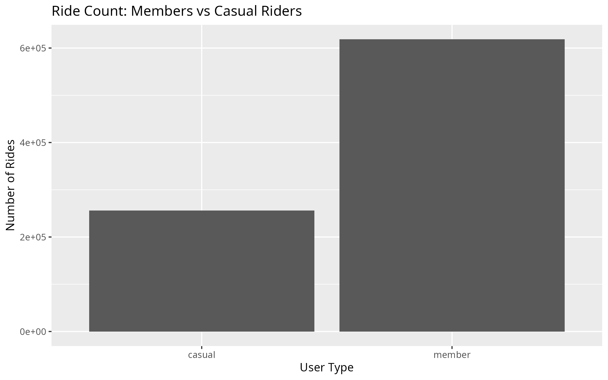
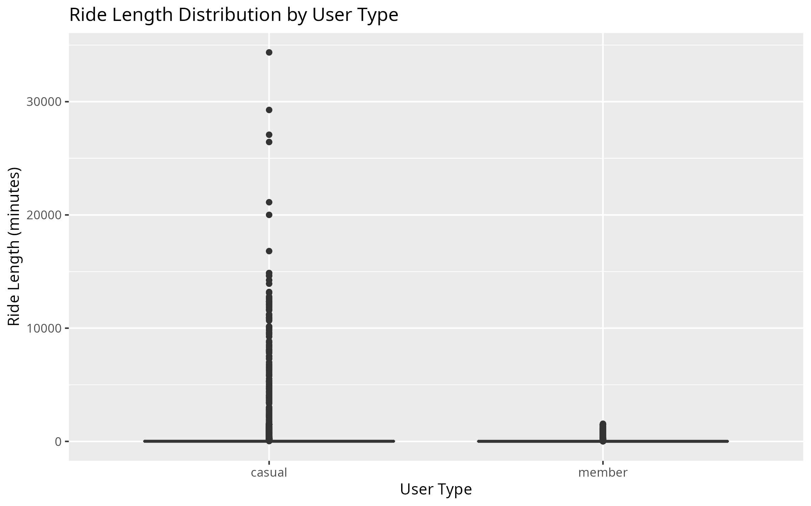
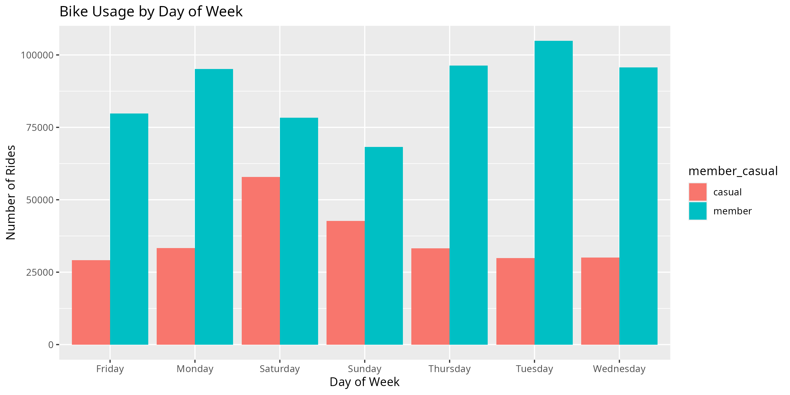
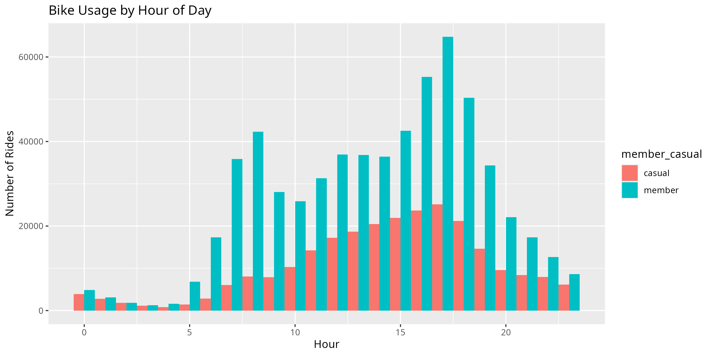

# 🚲 Cyclistic Bike-Share Analysis

## 📊 Business Problem
Cyclistic wants to increase annual memberships by converting casual riders into subscribers.

---

## 🎯 Objective
Analyze behavioral differences between casual riders and members to inform marketing strategy.

---

## 🧹 Data Cleaning
- Removed null and duplicate records
- Standardized column formats
- Calculated ride length
- Removed negative and unrealistic ride durations

---

## 📈 Analysis & Visualizations

### Member vs Casual Usage

### Ride Length Distribution

### Usage by Day of Week

### Time of Day Trends

---

## 🔍 Key Insights
- Casual riders take longer rides
- Members ride more frequently on weekdays
- Casual usage peaks on weekends
- Members use bikes for commuting patterns

---

## 💡 Recommendations
1. Target casual riders with weekday incentives  
2. Promote memberships for commuting benefits  
3. Offer discounts after multiple casual rides  

---

## 🛠 Tools Used
- R (tidyverse, ggplot2)
- Data cleaning & transformation
- Data visualization

---

## 📌 Conclusion
Casual riders show recreational behavior, while members demonstrate consistent commuting usage. Targeted strategies can convert high-frequency casual riders into members.
